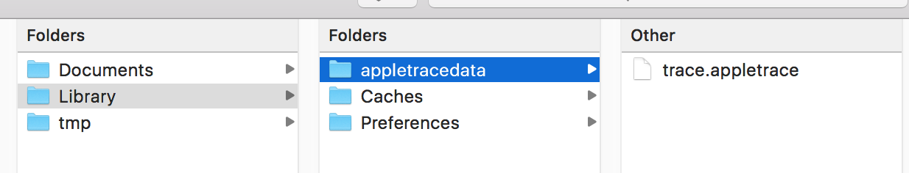

# AppleTrace

`AppleTrace` is developed for analyzing app's performance on `iOS`.

*>> I have developed a replacement called [Messier](https://messier.app/) which is much easier to use. :)*


- [中文说明，开发思路及方法](http://everettjf.github.io/2017/09/21/appletrace/)
- [搭载MonkeyDev可trace第三方App](http://everettjf.github.io/2017/10/12/appletrace-dancewith-monkeydev/)


## Feature

1. User-defined trace section.
2. Trace Objective C methods.

## FAQ

[Go to Wiki](https://github.com/everettjf/AppleTrace/wiki)

## Clone

```
git clone https://github.com/everettjf/AppleTrace.git
```

For stable release , please refer to [Releases](https://github.com/everettjf/AppleTrace/releases)

## Usage

1. Produce trace data.
2. Copy from app's sandbox directory.
3. Merge (all) trace data files into one file `trace.json`. (There may be more than 1 trace file.)
4. Generate `trace.html` based on `trace.json`.

See below for more detail.

### 1. Produce


Until now , there are 2 ways for generating trace data.

(1) Manual set section.

Call `APTBeginSection` at the beginning of method ,and `APTEndSection` at the end of method. For Objective C method (whether instance method or class method), there are `APTBegin` and `APTEnd` macro for easy coding.
	
```
void anyKindsOfMethod{
    APTBeginSection("process");
    // some code
    APTEndSection("process");
}

- (void)anyObjectiveCMethod{
    APTBegin;
    // some code
    APTEnd;
}
```
	
Sample app is `sample/ManualSectionDemo`.
	
(2) Dynamic library hooking all objc_msgSend.

Hooking all objc_msgSend methods (based on HookZz). This only support arm64 under debugger ( lldb).

Sample app is `sample/TraceAllMsgDemo`.

### 2. Copy

Using any kinds of method, copy `<app's sandbox>/Library/appletracedata` out of Simulator/RealDevice.




### 3. Merge

Merge/Preprocess the `appletracedata`.

```
python merge.py -d <appletracedata directory>
```

This will produce `trace.json` in appletracedata directory.

NOW !!!, you could drop `trace.json` into Chrome's `chrome://tracing`. Or if you want to generate a html result, continue to the 4th step.

### 4. Generate

Run `sh get_catapult.sh` to get catapult source.

Then generate `trace.html` using `catapult`.

```
python catapult/tracing/bin/trace2html appletracedata/trace.json --output=appletracedata/trace.html
open trace.html
```

*trace.html only support Chrome*

## SampleData

Open `sampledata/trace.html` using Chrome.

## Thanks

1. HookZz : https://github.com/jmpews/HookZz
2. catapult : https://github.com/catapult-project/catapult

## Group

欢迎关注微信订阅号，更多有趣的性能优化点点滴滴。


